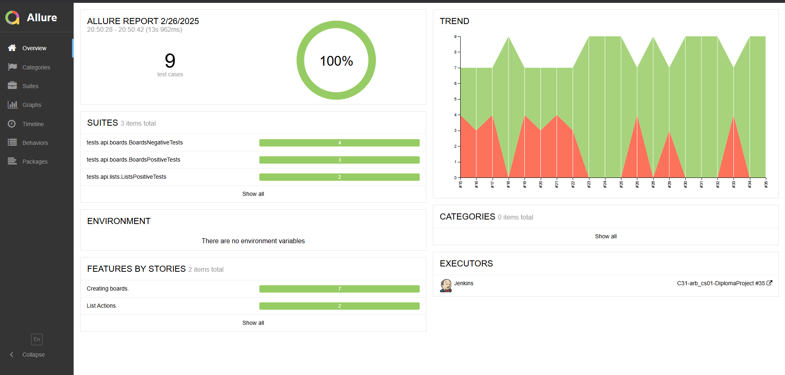
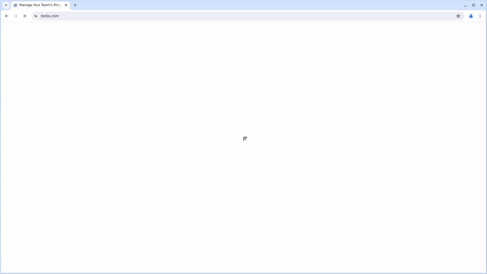

# Проект автоматизации тестирования [Trello](https://trello.com/).

## Содержание:

- Технологии и инструменты используемые для тестирования данного проекта.
- Реализованные проверки:
    - Тесты пользовательского интерфейса (WEB);
    - Тесты прикладного программного интерфейса (API).
- Способы запуска авто-тестов:
    - Локальный запуск;
    - Удаленный запуск;
    - Параметры для запуска тестов в Jenkins.
- Визуализация.

## Технологии и инструменты используемые для тестирования данного проекта.

<p style="text-align: center;">
<a href="https://www.jetbrains.com/idea/"> </a>
<a href="https://www.java.com/"> </a>
<a href="https://gradle.org/"> </a>
<a href="https://junit.org/junit5/"> </a>
<a href="https://selenide.org/"> </a>
<a href="https://rest-assured.io/"> </a>
<a href="https://github.com/"> </a>
<a href="https://allurereport.org/"> </a>
<a href="https://qameta.io/"> 
<a href="https://www.jenkins.io/"> </a>
<a href="https://aerokube.com/selenoid/"> </a>
</p>

Автоматизация тестовых сценариев выполнена с помощью языка программирования `Java`.
В качестве системы сборки используется `Gradle`, а в качестве фреймворка для тестирования `JUnit5`.

Для автоматизации графического (пользовательского) интерфейса используется библиотека `Selenide`, а для проверки API —
`REST-assured`.

Для предоставления отчетности о выполнении тестов использован инструмент — `Allure-Report`.
Отчет состоит из следующих элементов:
- Шаги;
- Снимок экрана для последнего шага теста;
- Видео выполнения;
- Исходный код страницы;
- Логи консоли браузера.

Дополнительным инструментом уведомления о прохождении тестов выступает ```telegram bot``` отправляющий отчет в
специально созданный для этого канал.

Указанные выше инструменты позволяют не только предоставить отчетность менеджерам, но и в случае проблем быстрее позволит
разобраться в причине падений тестов.

Удаленный запуск WEB тестов осуществляется с помощью `Selenoid`, который представляет собой ферму браузеров, а системой CI/CD
выступает — `Jenkins`.

## Реализация тестов.

#### Тесты API:
Выполнена проверка методов на предмет того, что они выполняют свою бизнес-функцию (В том числе, проверка значений определенных полей в теле ответа).
Помимо этого, конечно, есть проверки статусов кода. Также, в некоторых тестах проверяется соблюдение контракта.

#### Тесты WEB:
Есть тесты проверяющие аутентификацию пользователя, включая негативные сценарии.
Дополнительно, есть сценарии проверяющие основные пользовательские действия с базовыми сущностями Trello. К примеру, создание досок, списков, карточек и прочее.

## Запуск авто-тестов.

Все команды необходимо выполнять в эмуляторе терминала (консоль).

#### Локальный запуск авто-тестов.

API:

```bash
gradle clean api_tests -Denv=local
```

UI:

```bash
gradle clean ui_tests -Denv=local
```

#### Удаленный запуск авто-тестов.

API:

```bash
gradle clean api_tests
```

UI:

```bash
gradle clean ui_tests
```

#### Запуск тестов из Jenkins:

```bash
clean
${TASK}
-DbaseUrl=${BASE_URL}
-DbaseURI=${BASE_URI}
-Dremote=https://${SELENOID_USER}:${SELENOID_PASSWORD}@${REMOTE}/wd/hub
-Dbrowser=${BROWSER}
-DbrowserVersion=${VERSION}
-DbrowserSize=${BROWSER_SIZE}
-Dkey=${API_KEY}
-Dtoken=${API_TOKEN}
-Dusername="${USERNAME}"
-Dpassword=${PASSWORD}
```
> `baseUrl` — Адрес стенда для UI тестов.
> 
> `baseURI` — Адрес стенда для API тестов.
> 
> `remote` — Адрес на котором развернут Selenoid (для удаленного выполнения UI тестов).
> 
> `browser` — Имя браузера.
> 
> `browserVersion` — Версия браузера.
> 
> `browserSize` — Размер окна браузера.
> 
> `key` — API ключ.
> 
> `token` — API токен.
> 
> `username` — Логин пользователя.
> 
> `password` — Пароль пользователя.

## Визуализация.

### Запуск тестов в <a href="https://jenkins.autotests.cloud/job/C31-arb_cs01-DiplomaProject/"> Jenkins: </a>
<div style="text-align: center;">
    
</div>


### Отчеты в <a href="https://jenkins.autotests.cloud/job/C31-arb_cs01-DiplomaProject/30/allure/"> Allure Report: </a>
#### Главная страница отчета:
<div style="text-align: center;">
    
</div>

#### Страница набора тестов.
#### API:
<div style="text-align: center;">
    
</div>

#### UI:
<div style="text-align: center;">
    
</div>

#### Пример отправляемого отчета в telegram:
<div style="text-align: center;">
    
</div>

#### Видео выполнения теста в Selenoid:
<div style="text-align: center;">
    
</div>
